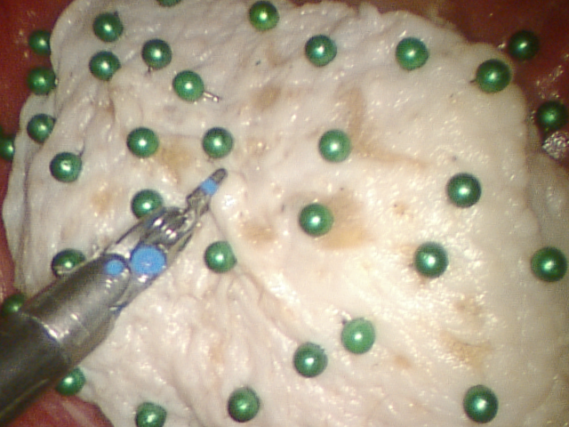
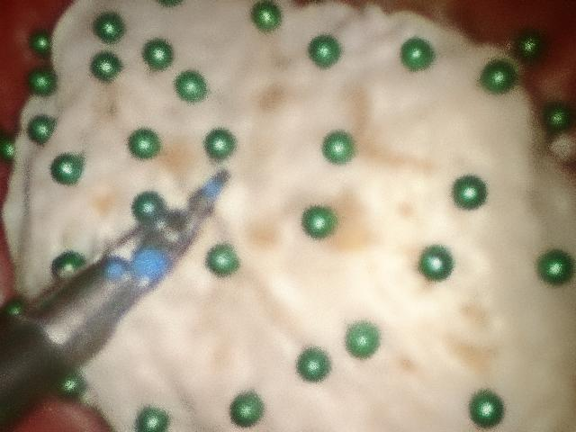
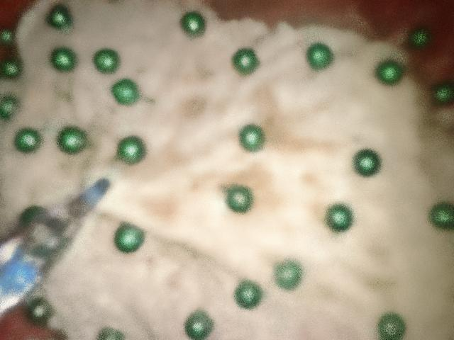
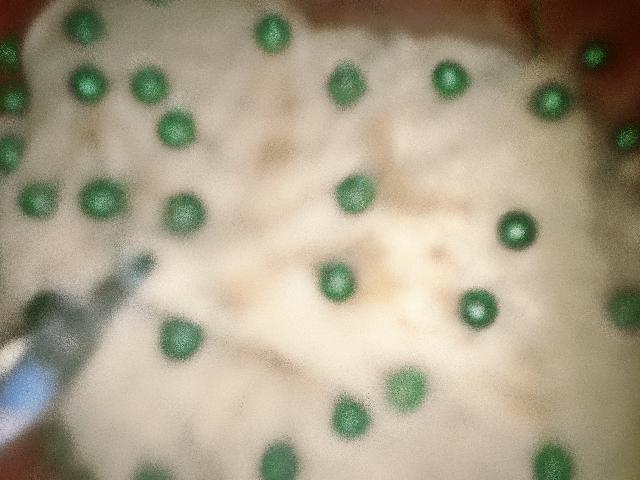
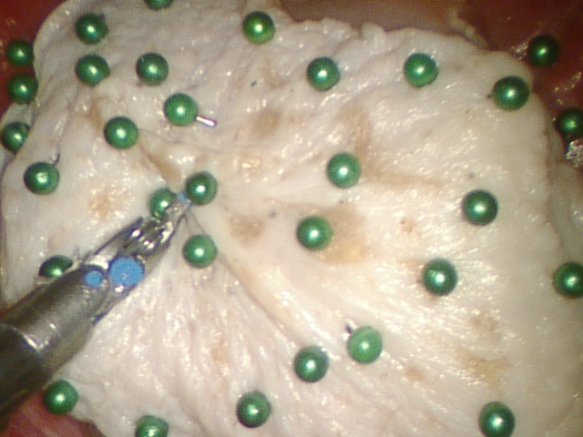
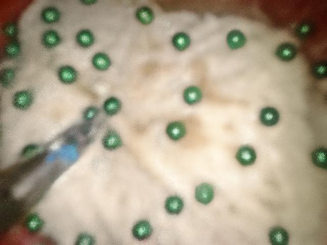
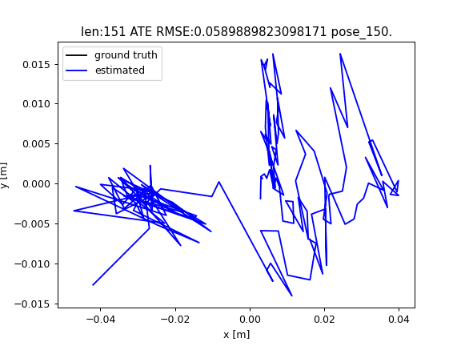
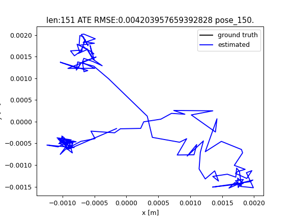

# DDS-SLAM Reproduction — Sample Results

## Trail3 (Lab1) — 151 frames on Colab T4

### Rendering Quality Comparison

| Method | PSNR ↑ | SSIM ↑ | LPIPS ↓ |
|--------|--------|--------|---------|
| **Paper (DDS-SLAM)** | **28.649** | **0.797** | **0.231** |
| Depth Anything V2 | 27.605 | 0.754 | 0.372 |
| Monodepth2 (rescaled) | 26.885 | 0.729 | 0.404 |

### Frame 0 (First Frame)
| Ground Truth | Depth Anything V2 | Monodepth2 |
|:---:|:---:|:---:|
|  |  |  |

### Frame 75 (Mid Sequence)
| Ground Truth | Depth Anything V2 | Monodepth2 |
|:---:|:---:|:---:|
|  |  |  |

### Frame 150 (Final Frame)
| Ground Truth | Depth Anything V2 | Monodepth2 |
|:---:|:---:|:---:|
|  |  |  |

### Estimated Camera Trajectories
| Depth Anything V2 | Monodepth2 |
|:---:|:---:|
|  |  |

## Notes
- Depth maps generated using alternative models (paper uses Python-SuPer finetuned Monodepth2, checkpoints inaccessible)
- Depth Anything V2 provides metric depth; Monodepth2 KITTI-pretrained required manual rescaling to surgical range
- RAFT-Stereo (stereo pairs) not yet evaluated
- Full details in [session log](../memory/session_20260323.md)
